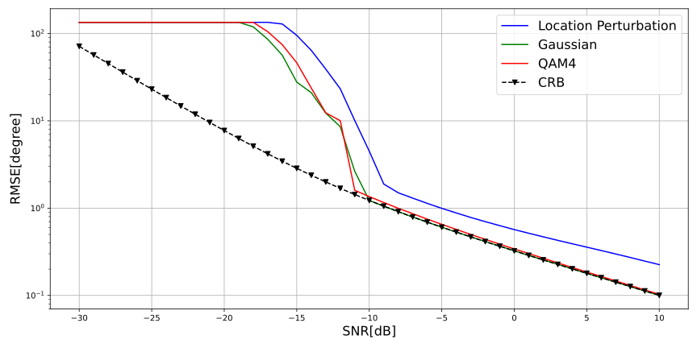

# Generative Barankin Bound

## Abstract

We introduce the Generative Barankin Bound (GBB), a learned Barankin Bound, for evaluating the achievable performance in
estimating the direction of arrival (DOA) of a source in non-asymptotic conditions, when the statistics of the
measurement are unknown. We first learn the measurement distribution using a conditional normalizing flow (CNF) and then
use it to derive the GBB. We show that the resulting learned bound approximates the analytical Barankin bound well for
the case of a Gaussian signal in Gaussian noise, Then, we evaluate the GBB for cases where analytical expressions for
the Barankin Bound cannot be derived. In particular, we study the effect of non-Gaussian scenarios on the threshold SNR.

## Installation & Run

Note that this code is working with Weights & Biases for loging and model saving.

``
pip install -r requirements.txt
``

Also install from source the doatools from this link: https://github.com/haihabi/pydoatools
To run the train please run the following command:

``
python main_flow_training_stage.py
``

And finally to produce results, please use:

``
python analysis/compare_optimal_learned.py
``

## Results
A demonstration of GBB on three cases.

## Cite

Will be available soon.

## Contributing
If you find a bug or have a question, please create a GitHub issue.

